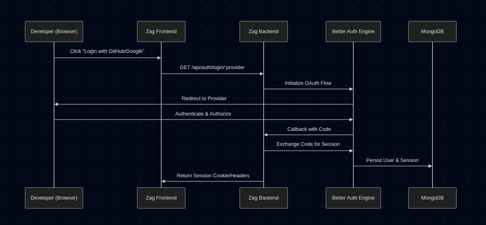
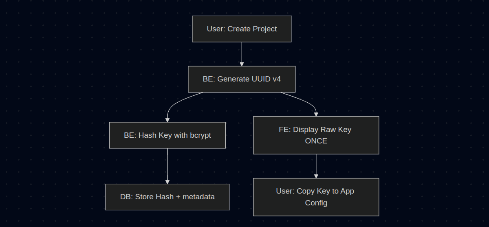
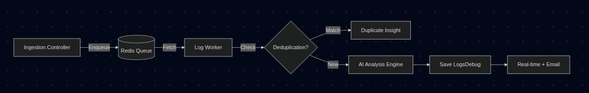

# Krvyu Project Flows

## 1. Multi-Layer Authentication & Settings Configuration

Krvyu utilizes a distributed authentication strategy to ensure consistent identity across RESTful APIs and real-time WebSocket streams.

### A. Authentication Lifecycle (Better Auth)
The platform delegates identity management to **Better Auth**, configured with a **MongoDB Adapter** for persistent session tracking.

- **Social Integration:** GitHub and Google OAuth are the primary entry points. Email/Password is deliberately disabled to enforce secure social identity.
- **Trusted Origins:** The backend strictly enforces CORS and Better Auth trusted origins based on the `FRONTEND_URL` environment variable.
- **Socket.IO Integration:** For real-time data, the WebSocket handshake intercepts headers. It manually extracts the session using `auth.api.getSession()`. If no valid session is found, the connection is terminated with an `Unauthorized` error before reaching the event handlers.

### B. Encrypted Settings Persistence (AES-256)
Personal AI configuration requires securing sensitive third-party API keys (OpenAI, Anthropic, Gemini).

- **Algorithm:** `aes-256-cbc`.
- **Key Derivation:** A 256-bit master key is derived from the project's `ENCRYPTION_KEY` using `crypto.scryptSync` with a fixed salt.
- **Layered Security:**
    1. **Encryption:** Each key is encrypted with a unique, randomized 16-byte Initialization Vector (IV). The stored format is `iv:ciphertext`.
    2. **Retrieval:** When the dashboard requests settings, keys are decrypted on-the-fly. If decryption fails (e.g., due to key rotation or malformed data), the platform falls back to returning the raw string to prevent system crashes.
    3. **Visibility:** The API only returns decrypted keys to the authenticated owner; they are never leaked in logs or to other users.

---

## 2. Project Tokenization & Secure Ingestion

Krvyu uses a hashed-token strategy (similar to GitHub Personal Access Tokens) to bridge external logs into the platform without compromising project security.

### A. Secret Key Generation Workflow

- **UUID Generation:** Uses `crypto.randomUUID()` to ensure collision-resistant, 128-bit project tokens.
- **Quota Validation:** Before generation, the system validates the user's `remainingProjects` count against the `totalProjects` limit defined in their `UserPlan`. If the limit is reached, key generation is blocked.
- **One-Way Hashing:** The `SecretKey` model utilizes an asynchronous `pre-save` middleware to hash the `key` field with `bcrypt` (Salt Rounds: 10).
- **Validation:** During ingestion, the platform performs a `bcrypt.compare` between the incoming raw token and the stored hash. This ensures that even a full database leak would not reveal the actual API keys used by developers.

---

## 3. The Log-to-Insight Pipeline (Async AI Engine)

The core value proposition of Krvyu is the asynchronous transformation of raw logs into AI-powered solutions.

### A. Phase 1: High-Throughput Ingestion
The public ingestion endpoint (`POST /api/logs/:keyId`) is designed for speed.

1. **Extraction:** Receives an array of logs (structured or raw strings).
2. **Gating & Rotation Check:** 
    - **Active Project Gating:** The system fetches all projects belonging to the user and sorts them by creation date. Log ingestion is only permitted for the oldest **X** projects (where X is the plan's `totalProjects` limit). If the project is inactive, the request is rejected with a 403 status.
    - **Global FIFO Rotation:** If the user's total account-wide log count reaches their `totalPreservedLogs` limit, the platform identifies and deletes the oldest logs **across all of the user's projects** to make room for new entries.
3. **Auto-Classification:** Logs without an explicit level run through `classifyLog` to identify severity.
4. **Database Bulk Insert:** Processed logs are batch-inserted via `insertMany`.
5. **Dashboard Broadcast:** Emits `GET_LOGS` via Socket.IO to the user's room.

### B. Phase 2: Background Orchestration (BullMQ)
Logs flagged as `warn` or `error` enter the AI pipeline managed by **BullMQ** and **Redis**.

- **Resilience:** Jobs are configured with **3 retry attempts** and **exponential backoff** (1s base).
- **Settings Check:** Before analysis, the worker verifies if `aiInsightsEnabled` is set to `true` in the `UserSettings`. If disabled, the AI analysis phase is skipped entirely.
- **Plan Gating (Notification):** Before constructing the email job, the system checks the `UserPlan` for `emailAlerts` support. Users on the "Hobby" tier are skipped for off-platform notifications.
- **Deduplication Logic:** To prevent redundant LLM costs, the worker queries the last 10 identical logs for the same project. If an insight already exists for that specific error message, it "clones" the previous explanation and solution instead of re-analyzing (only if AI insights are enabled).

### C. Phase 3: AI Analysis & Multi-Model Support
Krvyu uses a modular AI layer to interface with various LLMs via the `ai` library.

1. **Context Construction:** Combines the raw log with specialized **System Prompts** (`LOG_EXPLAINER`).
2. **Quota / Plan Validation:** 
    - **Free Tier:** Checks `UserPlan.remainingFreeInsights`. If zero, the analysis is skipped.
    - **BYOK Tier:** Checks `UserPlan.planType`. If "Hobby", use of personal keys is blocked even if configured in settings.
3. **Provider Resolution:** Based on `UserSettings`, instantiates the model (Gemini, GPT-4, etc.) using the decrypted API key.
4. **Quota Decrement:** Upon successful generation (if using free tier), `remainingFreeInsights` is atomically decremented.
5. **Response Parsing:** Extracts JSON block from AI output.

### D. Phase 4: Cross-Channel Notification
Once an insight is persisted, Krvyu triggers a multi-pronged notification flow, subject to user preferences:

1. **Real-time (Redis Pub/Sub):**
    - Triggered only if `aiInsightsEnabled` is active and an insight was generated.
    - The worker publishes to the `ai-insight-channel`.
    - A dedicated **Redis Subscriber** (running in the main server process) receives the message and pushes it through the WebSocket to the frontend.
2. **Off-Platform (Email):**
    - **Gating:** Triggered only if `emailErrorLogs` is enabled in `UserSettings` **AND** the user's `UserPlan` supports `emailAlerts` (Hobby users are excluded).
    - **Method:** **Nodemailer** constructs a rich HTML email.
    - It highlights the error and, if available, provides a "glimpse" of the AI insight with a link back to the Krvyu dashboard.

---

## 4. Quota Recovery & Cascading Deletion

To ensure quota integrity, Krvyu maintains strict sync between the database and the `UserPlan` model.

### A. Manual / Individual Deletion
The `ProjectLogs` model includes a `post-deleteOne` middleware. When a developer deletes a single log entry via the dashboard or API, the system automatically increments `remainingPreservedLogs` by 1.

### B. Project Deletion (Secret Key)
When a Project (SecretKey) is deleted, a cascading cleanup is triggered:
1. **Log Cleanup:** All `ProjectLogs` associated with that key are deleted.
2. **Quota Refund:** The total count of deleted logs is calculated and added back to the user's `remainingPreservedLogs` balance.
3. **Insight Cleanup:** All associated `LogsDebug` insights are removed.
